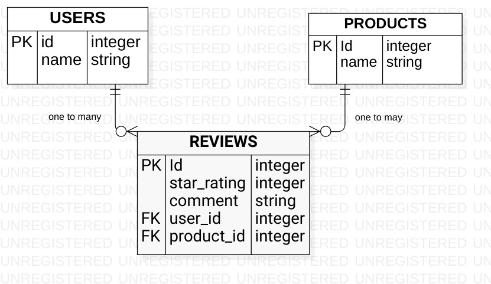

# Product reviews e-commerce domain

Our project has three main models: User, Review, and Product.

- Each user can leave multiple reviews for different products.
- The Review model represents the reviews left by users. Each review belongs to a user and a product, and includes a star rating and a comment about the product.
- The Product model represents the products available on our platform. Each product can have multiple reviews.

## Entity Relationship Diagram (ERD)

We designed our domain using Unified Modelling Language (UML), specifically, starUML. Here is the Entity Relationship Diagram (ERD) for our project:

</img>

The ERD illustrates the relationships between our three models: User, Review, and Product.

 # Getting started
## Installation
To install the repository on your machine follow the easy steps below;
-   Clone the repository using the following command:

        git@github.com:Jeffy2k/Phase3_code_challenge2.git

- To install the required gems run

        bundle install

-  To run the application run the following command

        ruby bin/run.rb

## Setting up the application
First set up the database by following the following steps;
- Navigate to the root directory
- To create database tables run

        bundle exec rake db:migrate

- To populate the tables run;

        bundle exec rake:seed

- To start a console session run;

        rake console

## Using the application

The three models have different models as explained below

- Review
    - #user
        - Returns the User instance for this Review

    - #product
        - Returns the Product instance for this Review
    - #print_review
        - This should puts in the terminal a string formatted as follows: Review for {insert product name} by {insert user name}: {insert review star_rating}. {insert review comment}
    - 

- Product
    - #reviews
        - Returns a collection of all the Reviews for the Product

    - #users
        - Returns a collection of all the Users who reviewed the Product
    - #leave_review(user, star_rating, comment)
        - Takes a User (an instance of the User class), a star_rating (integer), and a comment (string) as arguments, and creates a new Review in the database associated with this Product and the User
    - #print_all_reviews
        - This should puts in the terminal a string representing each review for this product
    - #average_rating
        - Returns a float representing the average star rating for all reviews for this product

- User
    - #reviews
        - Returns a collection of all the Reviews that the User has given
        
    - #products
        - Returns a collection of all the Products that the User has reviewed
    - #favorite_product
        - Returns the product instance that has the highest star rating from this user
    - #remove_reviews(product)
        - Takes a Product (an instance of the Product class) and removes all of this user's reviews for that product
        - You will have to delete any rows from the reviews table associated with this user and the product